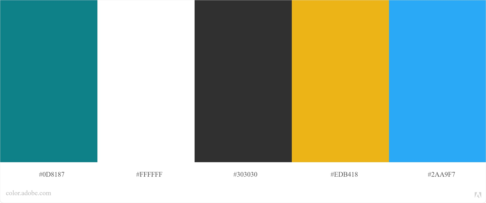
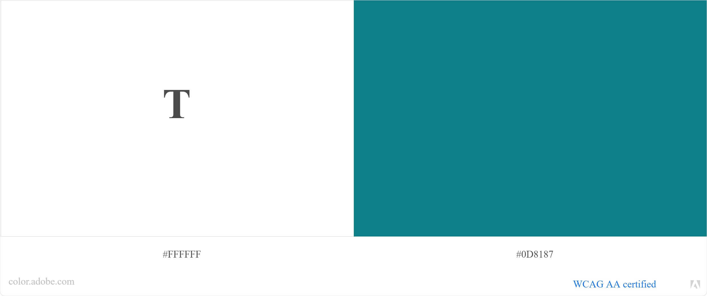

# Hackeuse_Poulette
 Link:https://still-wildwood-10518.herokuapp.com/
 
 ## Project done during BECODE learning process

## The mission
The company Hackers Poulette ™ sells Raspberry Pi accessory kits to build your own. They want to allow their users to contact their support team. Your mission is to create a fully-functioning online "contact support" form, in PHP. It must display a contact form and process the received answer (sanitize, validate, answer the user).

### plan the work ahead
https://app.moqups.com/zI3cUcVWRb/view/page/ad64222d5

### Blind Accessibility

### Color contrast check

